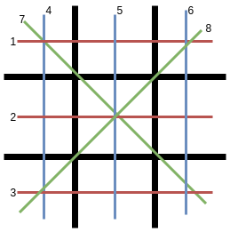

# Tic Tac Toe

## Description

In this project, you'll be recreating the classic game of Tic Tac Toe played on a 3-by-3 board. This will be played by two human players, taking turns until the game is over.

## Prerequisites

You should be familiar with:

- Conditional statements
- Loops (`for` loops, `while` loops)
- Lists / Arrays
- Functions
- Getting User Input

## Prompt

Lab 6-1: Tic Tac Toe

Lab Requirements and Specifications

Now that we have learned 2-Dimensional arrays, the first game you will be creating that uses a board is Tic Tac Toe!

The following are the gameplay requirements:

- This game is to be played by two human players, X and O.
- Players X and O should alternate turns placing pieces, with X going first. Players choose their position by entering a position (from 1 to 9 inclusive) on the board.
- The game should check to make sure that the players are choosing valid positions to place their pieces. If the player chooses an invalid position, he/she should be prompted again until he/she enters a valid position.
- The game should detect when the game is over (when someone has won / if it's a tie)
- You must validate all inputs - the user should not be able to crash the program.

The following are your code requirements:

- Functions should be heavily used throughout the game, and each function should have a single, well-defined purpose.
- Comments should be used to clarify processes and algorithms.
- Variable names should be descriptive and relevant.
- You should use a 2-dimensional list to check if a player has won (you are welcome to try otherwise, but this will be simplest)

If you are not familiar with the tic tac toe board, it's simply a grid 3 spaces tall, 3 spaces wide. It's typically drawn without its outer borders. Here is a sample ASCII representation of a tic tac toe board:

```
 1 | 2 | 3
---+---+---
 4 | 5 | 6
---+---+---
 7 | 8 | 9
```

(Xs and Os would be placed in the numbers)

Despite intuition telling us that we should use a 2D list for this, it would make our lives much more complicated than necessary. Instead, we can use a one-dimensional list for this, giving each position on the board a set number from 1 through 9. The player will pick their move by selecting a number from 1 to 9.

So where do 2D lists come into play? Since tic tac toe is played on a small board, there are limited winning sequences: - 3 for the rows (red) - 3 for the columns (blue) - 2 for the diagonals (green)



Since there are only eight possibilities of winning, you can check to see whether the game has ended by checking all possible winning sequences. The eight winning sequences are saved in a **2-Dimensional list/array**, where: - The outer list is the list of all wins - The inner list is the positions for each set of wins

The list of possible wins can be written in code as the following:

```
possible_wins = [
    [0,1,2], # first row
    [0,4,8], # topleft diagonal
    ... # and so on
```

You will know when someone has won when, for example, the 0th, 4th, and 8th position on the board are all non-empty and contain the same character.

One thing to note is to be careful about what you present to the user and what numbers should actually be used in the code. The following diagram illustrates the difference.


## Testing

To test the game, you simply need to play it against yourself. Be sure to check for the following edge cases:

- Entering a non-valid board move
- Entering a non-number board move
- The game ends in a draw
- Someone tries to take a spot that's already taken

## Extensions

### Play Against the Computer

Instead of having it be a two-human-player game, make it so that you play against the computer. Try to make the computer play as intelligently as possible. Bonus points if it's unbeatable and plays a perfect game!

### Ultimate Tic Tac Toe

Tic Tac Toe, being such a simple game, is understandably not fun. It's too easy! If everyone plays perfectly it'll end in a draw (and this happens often).

Luckily, someone came up with [Ultimate Tic Tac Toe](https://mathwithbaddrawings.com/2013/06/16/ultimate-tic-tac-toe/). Good luck!
